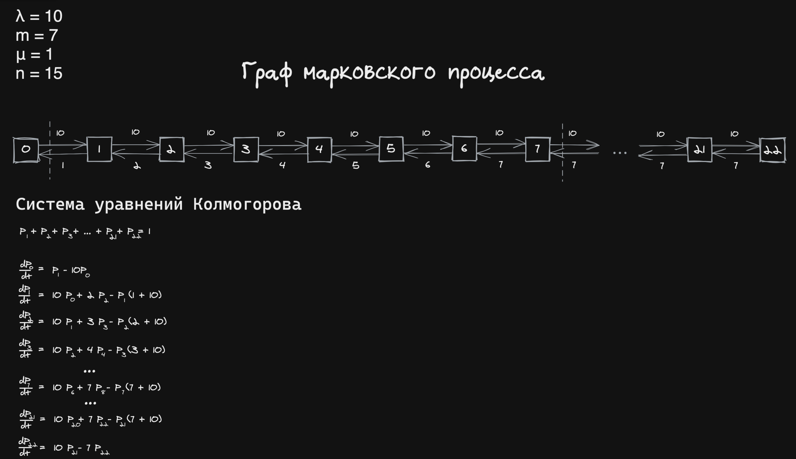

### Контрольная работа
### Вариант 52
### Выполнил: Баранов А.В. ПИ19-3 


```python
import numpy as np
from functools import lru_cache

def task1(matrix, k):
    """
    Вероятность перехода из состояния i в j за k шагов

    Args:
        matrix (numpy.ndarray): матрица переходов
        k (int): кол-во шагов
    """
    return np.linalg.matrix_power(matrix, k)


def task2(matrix, a_0, k):
    """
    Вероятность состояния за k шагов

    Args:
        matrix (numpy.ndarray): матрица переходов
        a_0 (numpy.ndarray): вероятности состояние в начальный момент времениъ
        k (int): кол-во шагов
    """
    return a_0.dot(np.linalg.matrix_power(matrix, k))

def task3(matrix, k):
    """
    Вероятность первого перехода за k шагов

    Args:
        matrix (numpy.ndarray): матрица переходов
        k (int): кол-во шагов
    """
    matrix_p = np.copy(matrix)
    for _ in range(1, k):
        matrix_p = skip_j_state(matrix, matrix_p)
    return matrix_p

def skip_j_state(matrix, matrix_pr):
    """
    Пропуск j состояния

    Args:
        matrix (numpy.ndarray): матрица переходов
        matrix_pr (numpy.ndarray): матрица переходов предыдущая
    """
    len_p = len(matrix)
    new_matrix = np.zeros((len_p, len_p))
    for i in range(len_p):
        for j in range(len_p):
            s = 0
            for m in range(len_p):
                if m != j:
                    s += matrix[i, m] * matrix_pr[m, j]
            new_matrix[i, j] = s
    return new_matrix

def task4(matrix, k):
    """
    Вероятность перехода не позднее чем за k шагов

    Args:
        matrix (numpy.ndarray): матрица переходов
        k (int): кол-во шагов
    """
    matrix_pr, result = np.copy(matrix), np.copy(matrix)
    for _ in range(1, k):
        matrix_pr = skip_j_state(matrix, matrix_pr)
        result+= matrix_pr
    return result

def task5(matrix):
    """
    Среднее количество шагов для перехода из состояния i в j

    Args:
        matrix (numpy.ndarray): матрица переходов
    """
    matrix_pr, result = np.copy(matrix), np.copy(matrix)
    for g in range(1, 1500):
        matrix_pr = skip_j_state(matrix, matrix_pr)
        result += g * matrix_pr
    return result

def task6(matrix, k):
    """
    Вероятность первого возвращения на k-ом шаге

    Args:
        matrix (numpy.ndarray): матрица переходов
        k (int): кол-во шагов
    """
    matrix_pr = np.copy(matrix)
    @lru_cache(maxsize=None)
    def f_jj(k):
        return np.linalg.matrix_power(matrix_pr, k) - sum([f_jj(m) * np.linalg.matrix_power(matrix_pr, k - m) for m in range(1, k)])

    return np.diagonal(f_jj(k))

def task7(matrix, k):
    """
    Вероятность возвращения не позднее чем за k шагов
    
    Args:
        matrix (numpy.ndarray): матрица переходов
        k (int): кол-во шагов
    """
    matrix_pr = np.copy(matrix)
    result = []

    @lru_cache(maxsize=None)
    def f_jj(k):
        res = np.linalg.matrix_power(matrix_pr, k) - sum([f_jj(m) * np.linalg.matrix_power(matrix_pr, k - m) for m in range(1, k)])
        result.append(np.diagonal(res))
        return res

    f_jj(k)
    return sum(result)

def task8(matrix):
    """
    Среднее время возвращения
    
    Args:
        matrix (numpy.ndarray): матрица переходов
    """
    matrix_pr, result = np.copy(matrix), []

    @lru_cache(maxsize=None)
    def f_jj(k=500):
        res = np.linalg.matrix_power(matrix_pr, k) - sum([f_jj(m) * np.linalg.matrix_power(matrix_pr, k - m) for m in range(1, k)])
        result.append(k * np.diagonal(res))
        return res
    f_jj()
    return sum(result)

def task9(matrix):
    """
    Установившиеся вероятности
    
    Args:
        matrix (numpy.ndarray): матрица переходов
    """
    matrix_ = np.copy(matrix).transpose()
    np.fill_diagonal(matrix_, np.diagonal(matrix_) - 1)
    matrix_[-1, :] = 1

    b_vector = np.zeros(len(matrix))
    b_vector[-1] = 1
    X = np.linalg.inv(matrix_).dot(b_vector)
    return X
```


```python
matrix = np.array([
    [0.05, 0.06, 0, 0, 0.3, 0.2, 0.39, 0, 0, 0, 0, 0, 0, 0],
    [0, 0.39, 0, 0, 0.45, 0, 0.16, 0, 0, 0, 0, 0, 0, 0],
    [0, 0.49, 0.14, 0.37, 0, 0, 0, 0, 0, 0, 0, 0, 0, 0],
    [0, 0, 0.35, 0.39, 0.24, 0, 0.02, 0, 0, 0, 0, 0, 0, 0],
    [0.01, 0, 0.12, 0.17, 0.04, 0.09, 0, 0.14, 0.19, 0.08, 0.16, 0, 0, 0],
    [0, 0.12, 0, 0, 0, 0.06, 0, 0.39, 0.14, 0, 0.29, 0, 0, 0],
    [0, 0.52, 0.42, 0, 0, 0, 0.06, 0, 0, 0, 0, 0, 0, 0],
    [0, 0, 0, 0, 0, 0.26, 0, 0.08, 0.66, 0, 0, 0, 0, 0],
    [0, 0, 0, 0, 0, 0.23, 0, 0.28, 0.22, 0, 0, 0.27, 0, 0],
    [0, 0, 0, 0, 0.32, 0, 0.62, 0, 0, 0.06, 0, 0, 0, 0],
    [0, 0, 0, 0, 0.74, 0, 0.16, 0, 0, 0, 0.1, 0, 0, 0],
    [0, 0, 0, 0, 0, 0, 0, 0.19, 0, 0.24, 0.19, 0.09, 0, 0.29],
    [0, 0, 0, 0, 0, 0, 0, 0, 0, 0, 0, 0, 0.12, 0.88],
    [0, 0, 0, 0, 0, 0, 0, 0, 0, 0, 0, 0.33, 0.6, 0.07]
])

print("Матрица переходов:")
print(matrix, "\n")
```

    Матрица переходов:
    [[0.05 0.06 0.   0.   0.3  0.2  0.39 0.   0.   0.   0.   0.   0.   0.  ]
     [0.   0.39 0.   0.   0.45 0.   0.16 0.   0.   0.   0.   0.   0.   0.  ]
     [0.   0.49 0.14 0.37 0.   0.   0.   0.   0.   0.   0.   0.   0.   0.  ]
     [0.   0.   0.35 0.39 0.24 0.   0.02 0.   0.   0.   0.   0.   0.   0.  ]
     [0.01 0.   0.12 0.17 0.04 0.09 0.   0.14 0.19 0.08 0.16 0.   0.   0.  ]
     [0.   0.12 0.   0.   0.   0.06 0.   0.39 0.14 0.   0.29 0.   0.   0.  ]
     [0.   0.52 0.42 0.   0.   0.   0.06 0.   0.   0.   0.   0.   0.   0.  ]
     [0.   0.   0.   0.   0.   0.26 0.   0.08 0.66 0.   0.   0.   0.   0.  ]
     [0.   0.   0.   0.   0.   0.23 0.   0.28 0.22 0.   0.   0.27 0.   0.  ]
     [0.   0.   0.   0.   0.32 0.   0.62 0.   0.   0.06 0.   0.   0.   0.  ]
     [0.   0.   0.   0.   0.74 0.   0.16 0.   0.   0.   0.1  0.   0.   0.  ]
     [0.   0.   0.   0.   0.   0.   0.   0.19 0.   0.24 0.19 0.09 0.   0.29]
     [0.   0.   0.   0.   0.   0.   0.   0.   0.   0.   0.   0.   0.12 0.88]
     [0.   0.   0.   0.   0.   0.   0.   0.   0.   0.   0.   0.33 0.6  0.07]] 
    


#### Задание 1
вероятность того, что за 10 шагов система перейдет из состояния 7 в состояние 4;


```python
k, i, j = 10, 7, 4
answer1 = task1(matrix, k)
print(f"Вероятность того, что за k={k} шагов система перейдет из состояния {i} в состояние {j} \n--> {answer1[i-1][j-1]}")
```

    Вероятность того, что за k=10 шагов система перейдет из состояния 7 в состояние 4 
    --> 0.10162746166399798


#### Задание 2
вероятности состояний системы спустя 5 шагов, если в начальный момент вероятность состояний были следующими 

A=(0,09;0,14;0,09;0,11;0,03;0,03;0,15;0,05;0,01;0,03;0,01;0,14;0,1;0,02);


```python
k = 5
a_0 = np.array([0.09, 0.14, 0.09, 0.11, 0.03, 0.03, 0.15, 0.05, 0.01, 0.03, 0.01, 0.14, 0.1, 0.02])
answer2 = task2(matrix, a_0, k)
print(f"Вероятности состояний системы спустя k={k} шагов, если в начальный "
      f"момент вероятность состояний были следующими \nA={a_0}\n\nОтвет: {answer2}")
```

    Вероятности состояний системы спустя k=5 шагов, если в начальный момент вероятность состояний были следующими 
    A=[0.09 0.14 0.09 0.11 0.03 0.03 0.15 0.05 0.01 0.03 0.01 0.14 0.1  0.02]
    
    Ответ: [0.00155962 0.13490165 0.08862983 0.09685694 0.1380779  0.06002486
     0.05048925 0.08737445 0.10836418 0.02673672 0.05533782 0.04723356
     0.03389584 0.07051738]


#### Задание 3
вероятность первого перехода за 7 шагов из состояния 10 в состояние 11;


```python
k, i, j = 7, 10, 11
answer3 = task3(matrix, k)
print(f"Вероятность первого перехода за k={k} шагов из состояния {i} в состояние {j} \n--> {answer3[i-1][j-1]}")
```

    Вероятность первого перехода за k=7 шагов из состояния 10 в состояние 11 
    --> 0.040633891945480005


#### Задание 4 
вероятность перехода из состояния 7 в состояние 9 не позднее чем за 10 шагов;


```python
i, j, k = 7, 9, 10
answer4 = task4(matrix, k)
print(f"Вероятность перехода из состояния {i} в состояние {j} не позднее чем за k={k} шагов \n--> {answer4[i-1][j-1]}")
```

    Вероятность перехода из состояния 7 в состояние 9 не позднее чем за k=10 шагов 
    --> 0.47037869358284934


#### Задание 5
среднее количество шагов для перехода из состояния 8 в состояние 10;


```python
i, j = 8, 10
answer5 = task5(matrix)
print(f"Среднее количество шагов для перехода из состояния {i} в состояние {j} \n--> {answer5[i-1][j-1]}")
```

    Среднее количество шагов для перехода из состояния 8 в состояние 10 
    --> 36.97986395057343


#### Задание 6
вероятность первого возвращения в состояние 7 за 6 шагов;


```python
i, k = 7, 6
answer6 = task6(matrix, k)
print(f"Вероятность первого возвращения в состояние {i} за k={k} шагов\n--> {answer6[i-1]}")
```

    Вероятность первого возвращения в состояние 7 за k=6 шагов
    --> 0.034992970596


#### Задание 7
вероятность возвращения в состояние 2 не позднее чем за 10 шагов;


```python
i, k = 2, 10
answer7 = task7(matrix, k)
print(f"Вероятность возвращения в состояние {i} не позднее чем за k={k} шагов\n--> {answer7[i-1]}")
```

    Вероятность возвращения в состояние 2 не позднее чем за k=10 шагов
    --> 0.7550709963020747


#### Задание 8
среднее время возвращения в состояние 7;


```python
i = 7
answer8 = task8(matrix)
print(f"Среднее время возвращения в состояние {i} \n--> {answer8[i-1]}")
```

    Среднее время возвращения в состояние 7 
    --> 20.10885080185027


#### Задание 9
установившиеся вероятности.


```python
answer9 = task9(matrix)
print(f"Установившиеся вероятности:\n--> {answer9}")
```

    Установившиеся вероятности:
    --> [0.00138007 0.11839194 0.0762807  0.08280653 0.13110661 0.07416231
     0.04972935 0.10389014 0.13315445 0.0259631  0.0594462  0.05798662
     0.03474405 0.05095793]


## Задание 2
Задана система массового обслуживания со следующими характеристиками:
* интенсивность поступления λ=10 
* каналов обслуживания m=7 
* интенсивность обслуживания μ=1 
* максимальный размер очереди n=15

Изначально требований в системе нет.


```python
import numpy as np
def create_matrix(L, m, u, n):
    """
    Создание матрицы по заданным параметрам

    Args:
        L (int): интенсивность поступления λ
        m (int): кол-во каналов обслуживания m
        u (int): интенсивность обслуживания μ
        n (int): максимальный размер очереди
    """
    p_matrix = np.zeros((m + n + 1, m + n + 1))
    for i in range(m + n):
        p_matrix[i, i+1] = L
        if i < m:
            p_matrix[i + 1, i] = (u * (i + 1))
        else:
            p_matrix[i + 1, i] = u*m
    return p_matrix

def task_a(matrix):
    """
    Установившиеся вероятности
    """
    diag_res = []
    for i in range(matrix.shape[0]):
        diag_res.append(matrix[i, :].sum())
    
    D = np.diag(diag_res)
    M = matrix.transpose() - D
    M_ = np.copy(M)
    M_[-1, :] = 1

    b_vector = np.zeros(M_.shape[0])
    b_vector[-1] = 1
    X = np.linalg.inv(M_).dot(b_vector)
    return X

def task_b(vector):
    """
    Вероятность отказа в обслуживании
    """
    return vector[-1]

def task_c(vector, L):
    """
    Относительная и абсолютная интенсивность обслуживания
    """
    relative = 1 - vector[-1]
    return relative, relative * L

def task_d(vector, m, n):
    """
    Средняя длина очереди
    """
    s = 0
    for i in range(1, n+1):
        s+=i * vector[m+i]
    return s


def task_e(vector, m, u, n):
    """
    Среднее время в очереди
    """
    s = 0
    for i in range(n):
        s+= ((i+1)/(m*u)*vector[m+i])
    return s

def task_f(vector, m, n):
    """
    Среднее число занятых каналов
    """
    s = 0
    for i in range(1, m+n+1):
        if i <= m:
            s+= i * vector[i]
        else:
            s+= m * vector[i]
    return s


def task_g(vector, m):
    """
    Вероятность не ждать в очереди
    """
    return sum(vector[:m])


def task_h(matrix):
    """
    Среднее время простоя системы массового обслуживания
    """
    return 1 / np.sum(matrix, -1)
```


```python
L = 10
m = 7
u = 1
n = 15
matrix = create_matrix(L, m, u, n)
print("Матрица переходов:")
print(matrix)
```

    Матрица переходов:
    [[ 0. 10.  0.  0.  0.  0.  0.  0.  0.  0.  0.  0.  0.  0.  0.  0.  0.  0.
       0.  0.  0.  0.  0.]
     [ 1.  0. 10.  0.  0.  0.  0.  0.  0.  0.  0.  0.  0.  0.  0.  0.  0.  0.
       0.  0.  0.  0.  0.]
     [ 0.  2.  0. 10.  0.  0.  0.  0.  0.  0.  0.  0.  0.  0.  0.  0.  0.  0.
       0.  0.  0.  0.  0.]
     [ 0.  0.  3.  0. 10.  0.  0.  0.  0.  0.  0.  0.  0.  0.  0.  0.  0.  0.
       0.  0.  0.  0.  0.]
     [ 0.  0.  0.  4.  0. 10.  0.  0.  0.  0.  0.  0.  0.  0.  0.  0.  0.  0.
       0.  0.  0.  0.  0.]
     [ 0.  0.  0.  0.  5.  0. 10.  0.  0.  0.  0.  0.  0.  0.  0.  0.  0.  0.
       0.  0.  0.  0.  0.]
     [ 0.  0.  0.  0.  0.  6.  0. 10.  0.  0.  0.  0.  0.  0.  0.  0.  0.  0.
       0.  0.  0.  0.  0.]
     [ 0.  0.  0.  0.  0.  0.  7.  0. 10.  0.  0.  0.  0.  0.  0.  0.  0.  0.
       0.  0.  0.  0.  0.]
     [ 0.  0.  0.  0.  0.  0.  0.  7.  0. 10.  0.  0.  0.  0.  0.  0.  0.  0.
       0.  0.  0.  0.  0.]
     [ 0.  0.  0.  0.  0.  0.  0.  0.  7.  0. 10.  0.  0.  0.  0.  0.  0.  0.
       0.  0.  0.  0.  0.]
     [ 0.  0.  0.  0.  0.  0.  0.  0.  0.  7.  0. 10.  0.  0.  0.  0.  0.  0.
       0.  0.  0.  0.  0.]
     [ 0.  0.  0.  0.  0.  0.  0.  0.  0.  0.  7.  0. 10.  0.  0.  0.  0.  0.
       0.  0.  0.  0.  0.]
     [ 0.  0.  0.  0.  0.  0.  0.  0.  0.  0.  0.  7.  0. 10.  0.  0.  0.  0.
       0.  0.  0.  0.  0.]
     [ 0.  0.  0.  0.  0.  0.  0.  0.  0.  0.  0.  0.  7.  0. 10.  0.  0.  0.
       0.  0.  0.  0.  0.]
     [ 0.  0.  0.  0.  0.  0.  0.  0.  0.  0.  0.  0.  0.  7.  0. 10.  0.  0.
       0.  0.  0.  0.  0.]
     [ 0.  0.  0.  0.  0.  0.  0.  0.  0.  0.  0.  0.  0.  0.  7.  0. 10.  0.
       0.  0.  0.  0.  0.]
     [ 0.  0.  0.  0.  0.  0.  0.  0.  0.  0.  0.  0.  0.  0.  0.  7.  0. 10.
       0.  0.  0.  0.  0.]
     [ 0.  0.  0.  0.  0.  0.  0.  0.  0.  0.  0.  0.  0.  0.  0.  0.  7.  0.
      10.  0.  0.  0.  0.]
     [ 0.  0.  0.  0.  0.  0.  0.  0.  0.  0.  0.  0.  0.  0.  0.  0.  0.  7.
       0. 10.  0.  0.  0.]
     [ 0.  0.  0.  0.  0.  0.  0.  0.  0.  0.  0.  0.  0.  0.  0.  0.  0.  0.
       7.  0. 10.  0.  0.]
     [ 0.  0.  0.  0.  0.  0.  0.  0.  0.  0.  0.  0.  0.  0.  0.  0.  0.  0.
       0.  7.  0. 10.  0.]
     [ 0.  0.  0.  0.  0.  0.  0.  0.  0.  0.  0.  0.  0.  0.  0.  0.  0.  0.
       0.  0.  7.  0. 10.]
     [ 0.  0.  0.  0.  0.  0.  0.  0.  0.  0.  0.  0.  0.  0.  0.  0.  0.  0.
       0.  0.  0.  7.  0.]]


#### Задание а
Составьте граф марковского процесса, запишите систему уравнений Колмогорова и найдите установившиеся вероятности состояний.




```python
vector = task_a(matrix)
print(f"Составьте граф марковского процесса, запишите систему уравнений Колмогорова и \
найдите установившиеся вероятности состояний:\n--> {vector}")
```

    Составьте граф марковского процесса, запишите систему уравнений Колмогорова и найдите установившиеся вероятности состояний:
    --> [7.18740931e-07 7.18740931e-06 3.59370466e-05 1.19790155e-04
     2.99475388e-04 5.98950776e-04 9.98251294e-04 1.42607328e-03
     2.03724754e-03 2.91035363e-03 4.15764804e-03 5.93949720e-03
     8.48499599e-03 1.21214228e-02 1.73163184e-02 2.47375977e-02
     3.53394252e-02 5.04848932e-02 7.21212759e-02 1.03030394e-01
     1.47186277e-01 2.10266111e-01 3.00380158e-01]


#### Задание b
Найдите вероятность отказа в обслуживании.


```python
answer_b = task_b(vector)
print(f"Найдите вероятность отказа в обслуживании:\n--> {answer_b}")
```

    Найдите вероятность отказа в обслуживании:
    --> 0.30038015805067136


#### Задание c
Найдите относительную и абсолютную интенсивность обслуживания.


```python
relative, absolute = task_c(vector, L)
print("Найдите относительную и абсолютную интенсивность обслуживания:")
print(f"Относительная: {relative}\nАбсолютная: {absolute}")
```

    Найдите относительную и абсолютную интенсивность обслуживания:
    Относительная: 0.6996198419493287
    Абсолютная: 6.996198419493287


#### Задание d
Найдите среднюю длину в очереди.


```python
answer_d = task_d(vector, m, n)
print(f"Найдите среднюю длину в очереди:\n--> {answer_d}")
```

    Найдите среднюю длину в очереди:
    --> 12.693809465402772


#### Задание e
Найдите среднее время в очереди.


```python
answer_e = task_e(vector, m, u, n)
print(f"Найдите среднее время в очереди:\n--> {answer_e}")
```

    Найдите среднее время в очереди:
    --> 1.2693809465402774


#### Задание f
Найдите среднее число занятых каналов


```python
answer_f = task_f(vector, m, n)
print(f"Найдите среднее число занятых каналов:\n--> {answer_f}")
```

    Найдите среднее число занятых каналов:
    --> 6.996198419493287


#### Задание g
Найдите вероятность того, что поступающая заявка не будет ждать в очереди.


```python
answer_g = task_g(vector, m)
print(f"Найдите вероятность того, что поступающая заявка не будет ждать в очереди:\n--> {answer_g}")
```

    Найдите вероятность того, что поступающая заявка не будет ждать в очереди:
    --> 0.002060310810089949


#### Задание h
Найти среднее время простоя системы массового обслуживания.


```python
answer_h = task_h(matrix)
print(f"Найти среднее время простоя системы массового обслуживания:\n--> {answer_h[0]}")
```

    Найти среднее время простоя системы массового обслуживания:
    --> 0.1

